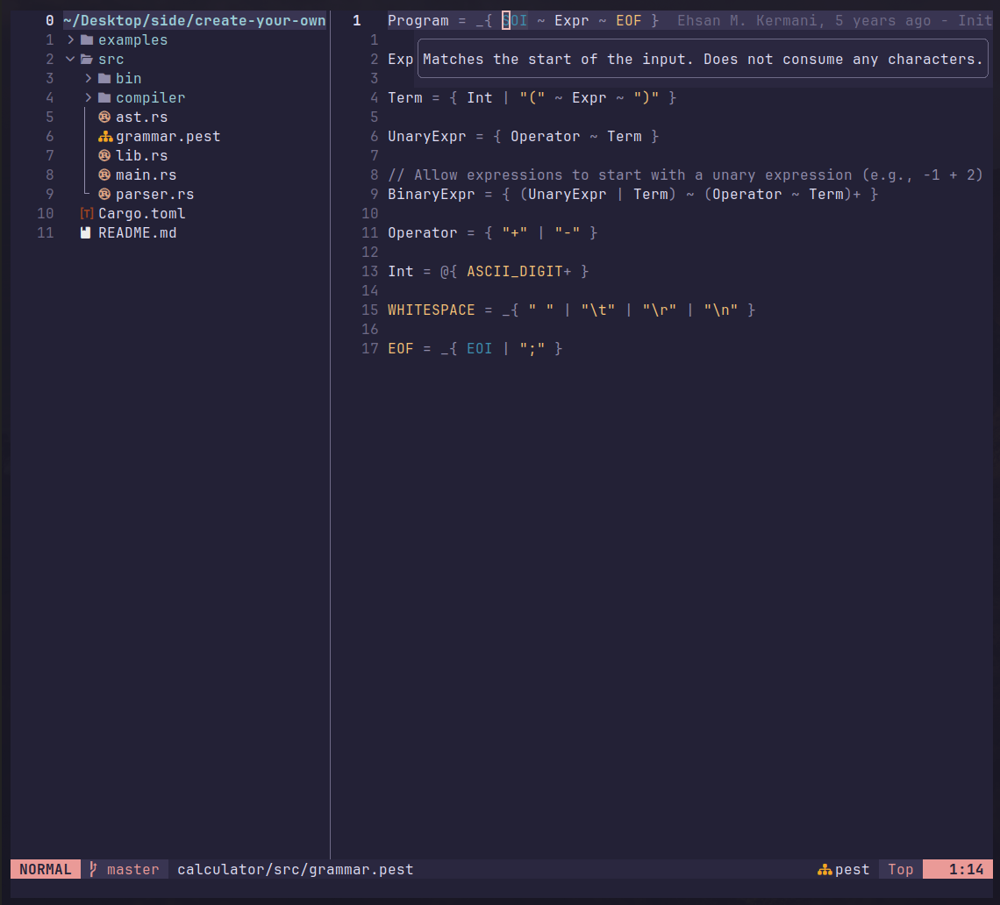

# pest.nvim

Syntax highlighting for [pest](https://github.com/pest-parser/pest) PEG grammar
files.

Example (using the rose-pine color scheme):


## Neovim LSP support

## Installation

> Requires [nvim-treesitter](https://github.com/nvim-treesitter/nvim-treesitter)

### Using [lazy.nvim](https://github.com/folke/lazy.nvim)
```lua
{
  'pest-parser/pest.nvim',
  dependencies = { 'nvim-treesitter/nvim-treesitter' },
}
```

### Using [packer.nvim](https://github.com/wbthomason/packer.nvim)
```lua
use {
  'pest-parser/pest.nvim',
  requires = { 'nvim-treesitter/nvim-treesitter' },
}
```

### Using [vim-plug](https://github.com/junegunn/vim-plug)
Add the following to your `vimrc` or `init.vim`:
```vim
Plug 'nvim-treesitter/nvim-treesitter'
Plug 'pest-parser/pest.nvim'
```

### Using [dein.vim](https://github.com/Shougo/dein.vim)
```vim
call dein#add('nvim-treesitter/nvim-treesitter')
call dein#add('pest-parser/pest.nvim')
```

After the installation is complete run the command:
```vim
:TSInstall pest
```

If `pest` is not detected restart neovim and rerun the command.

## Icon support

`.pest` files can display a custom icon (nf-fa-sitemap) in file explorers
and status lines. This is optional and requires a [Nerd Font](https://www.nerdfonts.com/)
to be installed and set as your terminal font.

Icon support is available for [nvim-web-devicons](https://github.com/nvim-tree/nvim-web-devicons) and [mini.icons](https://github.com/echasnovski/mini.icons).

### Install language server

If you're using [mason.nvim](https://github.com/williamboman/mason.nvim), run:
```vimrc
:MasonInstall pest-language-server
```

Or install it manually:
```bash
cargo install pest-language-server
```

### Set up language server

> **No LSP?** Follow [this setup tutorial](https://www.youtube.com/watch?v=IZnhl121yo0) to get one configured.

Create a new file `pest_ls.lua` on the lsp folder.
Then paste this code:
```lua
return {
  cmd = { 'pest-language-server' },
  filetypes = { 'pest' },
  root_markers = {'Cargo.toml', '.git' },
}
```
